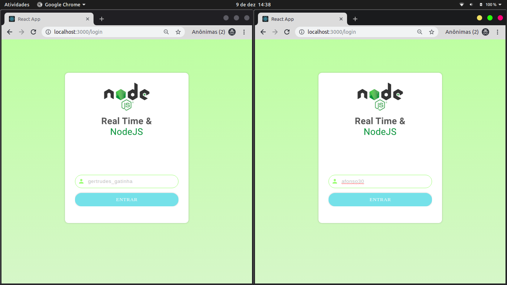
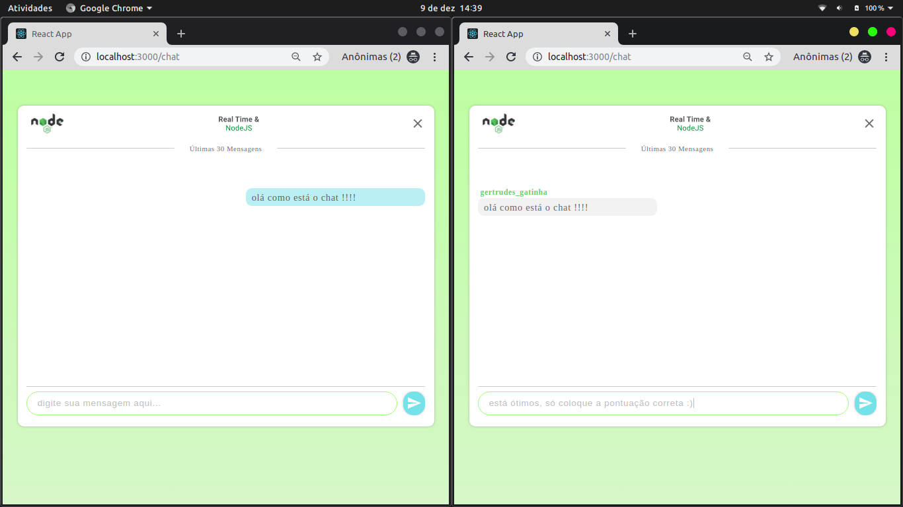
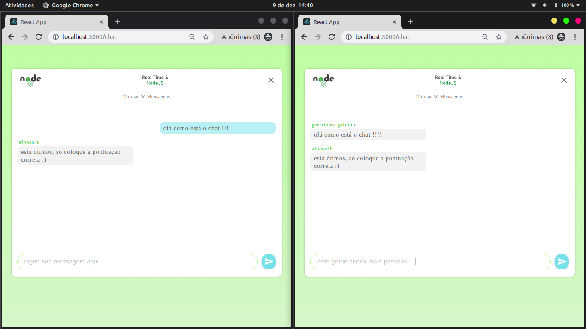
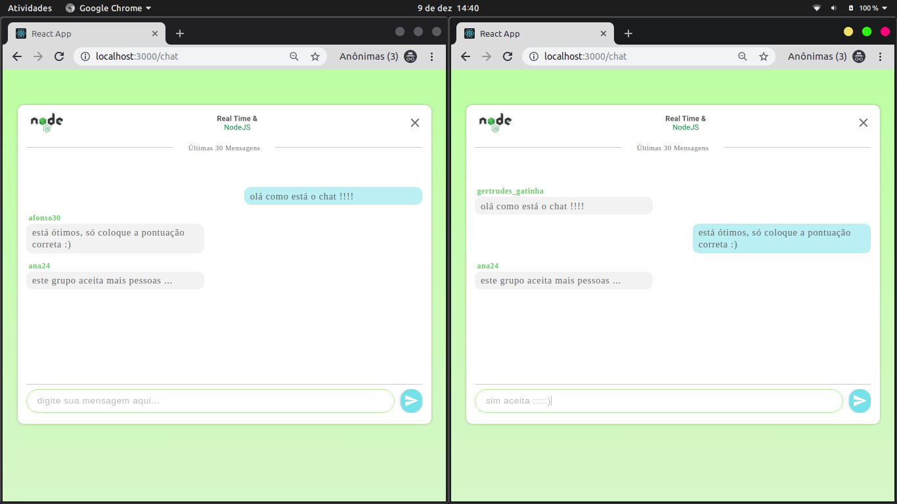

# Chat With NodeJS

In this project i'm build an application que have comunication in real time, i'm using node to build the server and reactjs for user interfca.
The project is simple, the user select an nick name and can send messages for all users conecteds in real time.

## Demostration

## Technologies

- NodeJS
- Sequelize (ORM)
- Postgres
- Cors
- SocketIO (For websocket)
- ReactJS
- Styled-components
- Axios
- React-router-dom
